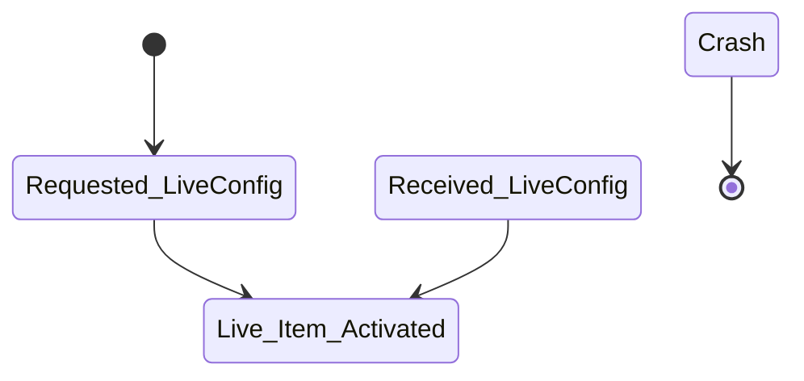
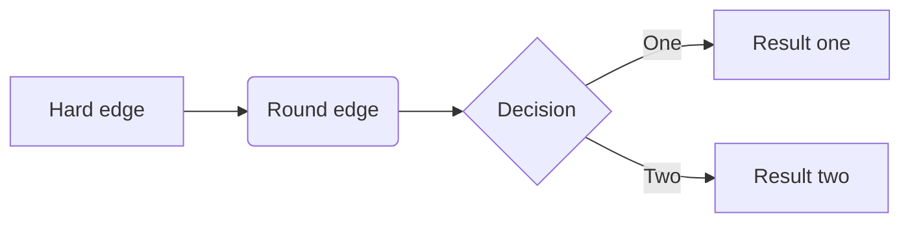

# Select version 1.0 or 2.0

```mermaid
stateDiagram
    [*] --> Requested_LiveConfig
    Requested_LiveConfig --> Live_Item_Activated
    Received_LiveConfig --> Live_Item_Activated
    Crash --> [*]
```

```mermaid
graph LR
A[Hard edge] -->B(Round edge)
    B --> C{Decision}
    C -->|One| D[Result one]
    C -->|Two| E[Result two]
```
